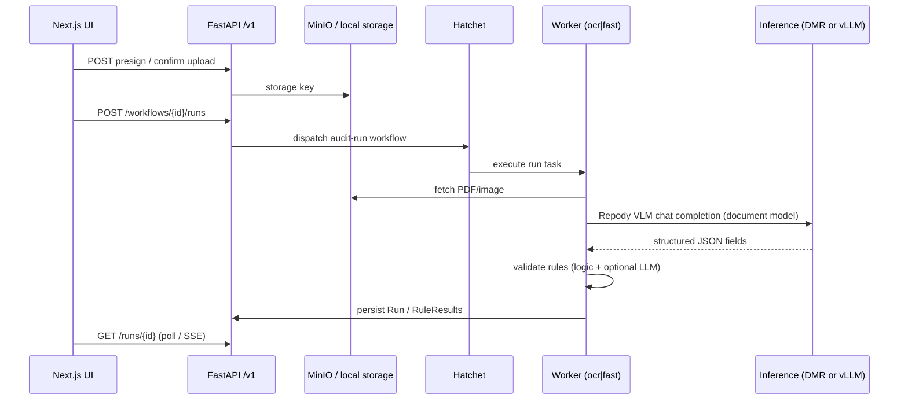

# Repody — architecture context

Single-page map for tech leads and new contributors. Operational how-tos live in [README.md](./README.md), [DEV.md](./DEV.md), and [DEPLOY.md](./DEPLOY.md). Recorded decisions live in [docs/adr/](./docs/adr/).

## Names (read once)

| Name | Where | Meaning |
|------|--------|---------|
| **Repody** | Product, repo, npm package, Compose project | Public name everywhere |
| **repody** | Python distribution (`backend/pyproject.toml`) | `pip install -e backend` |
| **audit_workbench** | `backend/src/audit_workbench/` | Python import path (legacy; stable for migrations) |

Docker Model Runner tags use the `repody/` namespace (e.g. `repody/repody-vlm:q4_k_m-16k`).

## Domain glossary

| Term | Meaning |
|------|---------|
| **Workflow** | Configured audit template: documents, field schema, validation rules |
| **Run** | One execution of a workflow against uploaded files (test or production) |
| **Document model** | Vision-language model that maps document images → structured JSON fields (Repody VLM today) |
| **Processing path** | How a document is read (`document_model` = direct image-to-schema) |
| **Logic rule** | Deterministic check via `simpleeval` on extracted fields |
| **LLM rule** | Natural-language rule evaluated by a small text model (separate from Repody VLM) |
| **Worker pool `ocr`** | Hatchet worker that runs document-model extraction (GPU/CPU bound) |
| **Worker pool `fast`** | Hatchet worker for logic-only / no-file runs |

Historical note: settings still use **“OCR”** in env names (`AUDIT_DEFAULT_OCR_MODEL`). That means **document model catalog**, not a separate OCR engine stack.

## Request lifecycle



All audit runs are dispatched through Hatchet; worker containers execute `process_run`.

## Backend layers

```
backend/src/audit_workbench/
├── api/           HTTP routers → mostly delegate to services
├── services/      Business logic (runs, workflows, audits, maintenance)
├── extraction/    Document pipeline, model catalog, Repody VLM client
├── inference/     OpenAI-compat clients (Docker Model Runner, vLLM, structured LLM)
├── rules/         Logic + LLM evaluators
├── hatchet/       Worker entrypoint + workflow definitions
├── db/            SQLAlchemy models + Alembic
├── schemas/       Pydantic DTOs (CamelModel → JSON camelCase)
└── storage/       Local filesystem + S3/MinIO
```

**Intentional coupling:** `api/platform.py` exposes diagnostics and catalog endpoints that call extraction/inference directly for operator visibility. Everything else on the hot path goes through services.

## Three registries (do not merge)

| Module | Selects | Example ids |
|--------|---------|-------------|
| `extraction/pipeline.py` (`get_extractor`) | **Extractor implementation** | `stub`, `pipeline` (`AUDIT_EXTRACTOR`) |
| `extraction/model_registry.py` | **Document model catalog** | `repody:vlm` (legacy `repody:vlm`) |
| `services/document_model_catalog.py` | **Catalog + live runtime probes** | used by `/models/catalog`, diagnostics, healthz |

Flow: `get_extractor()` → `PipelineExtractor` → `parse_document_model()` → `extract_with_repody_vlm()` (legacy name) on the runtime chosen by `AUDIT_INFERENCE_MODE`.

## Inference runtimes

| `AUDIT_INFERENCE_MODE` | Deploy | Document extraction |
|------------------------|--------|---------------------|
| `docker_model_runner` | `pnpm compose up --stack=prod --build` | Repody VLM GGUF via Docker Model Runner (CPU) |
| `vllm` | `pnpm compose up --stack=gpu --build` | Repody VLM via vLLM (GPU) |

LLM **rule validation** uses a separate small text model on Docker Model Runner when `AUDIT_LLM_VALIDATION_ENABLED=true`. It never shares the document-model runtime.

**Intentional asymmetry:** `AUDIT_INFERENCE_MODE=vllm` switches **document extraction** to vLLM only. LLM rule validation always uses `get_inference_client()` → Docker Model Runner (or stub). Do not point validation at vLLM unless you add a dedicated `AUDIT_VALIDATION_RUNTIME` setting and record that in an ADR.

Add future document models in `extraction/model_registry.py` (`_registered_models()`).

## Frontend layout

Next.js 16 App Router at repo root (not under `frontend/`):

- `app/` — routes (thin pages)
- `components/` — domain UI (`workflow/`, `audit/`, `dashboard/`)
- `lib/api/` — typed clients; RSC uses `serverFetch`/`serverJson`, client islands use `/api/*` rewrite to backend `/v1/*`

## Platform modules (deploy)

Runtime is split into **modules** (`infra`, `control`, `workers`, `edge`, `obs`, `traces`, `bugsink`) composed via stack presets. See [docs/PLATFORM.md](./docs/PLATFORM.md) and [ADR 003](./docs/adr/003-modular-platform-modules.md).

| Term | Meaning |
|------|---------|
| **Platform module** | Independently deployable Compose service group (microservice seam) |
| **Stack preset** | Base chain (`dev`, `prod`, `vps`, `gpu`) + overlays (`--warmup`, `--scale`, …) |
| **Worker plane** | Horizontally scaled Hatchet workers (`worker`, `worker-fast`) |

## Compose file chain

Prefer **`pnpm compose`** with stack presets and `--with` modules:

| Goal | Command |
|------|---------|
| Dev + warmup + Loki | `pnpm dev -- --warmup --logs` |
| Prod scale + addons | `pnpm compose up --stack=prod --scale --with=obs --build` |
| Scale OCR workers | `pnpm compose scale --stack=prod --scale --worker=3` |

| Goal | Files |
|------|-------|
| Dev (fast) | `deploy/compose/base.yaml` + `cpu.yaml` + `dev.yaml` |
| Prod CPU | `deploy/compose/base.yaml` + `cpu.yaml` + `prod.yaml` |
| Prod GPU | above + `deploy/compose/gpu.yaml` |
| CI Playwright smoke | `deploy/compose/base.yaml` + `e2e.yaml` |

Module manifest: [deploy/platform-modules.mjs](./deploy/platform-modules.mjs). CLI: [deploy/scripts/compose.mjs](./deploy/scripts/compose.mjs).

## Non-product paths

These directories are agent/tooling assets, not runtime dependencies:

- `.agents/skills/` — Cursor agent skills
- `src/ui-ux-pro-max/` — design reference data for UI skills
- `benchmark-reports/` — local benchmark output

## Tests

| Layer | Command | CI |
|-------|---------|-----|
| Backend unit/integration | `pnpm test:api` (`pytest -m "not live"`, Postgres + Alembic) | `.github/workflows/ci.yml` |
| Live stack (Hatchet + workers) | `E2E_STACK=1 pytest -m live` | compose-smoke / manual |
| Playwright smoke | `pnpm test:e2e:smoke` | `.github/workflows/e2e.yml` (nightly + manual) |
| Full platform | `pnpm test:platform` | Manual / nightly (heavier) |

Run completion and Hatchet dispatch are **not** simulated in-process. Use `@pytest.mark.live` with a running docker stack (`E2E_STACK=1`, `E2E_API_URL`).

## Authorization (Casbin)

JWT roles map to permissions in `auth/rbac_policy.csv`. Routers use `require_permission(resource, action)` — not a blanket admin gate. When `AUDIT_OIDC_ENABLED=false` (local dev/tests), the API uses a `platform_admin` dev principal.

| Role | Typical access |
|------|----------------|
| `viewer` | Read workflows, runs, audits, models, rules |
| `operator` | Viewer + write workflows, execute runs, operator tools |
| `admin` | Operator + metrics, settings, diagnostics |

## Further reading

- [docs/adr/001-hatchet-async-runs.md](./docs/adr/001-hatchet-async-runs.md)
- [docs/adr/002-repody-vlm-dual-inference-runtimes.md](./docs/adr/002-repody-vlm-dual-inference-runtimes.md)
- [docs/BACKEND_STEPS.md](./docs/BACKEND_STEPS.md) — milestone history
- [docs/E2E.md](./docs/E2E.md) — full stack test layers
