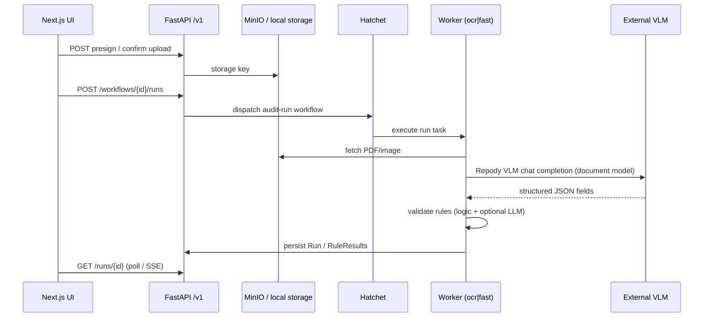

# Repody — architecture context

Single-page map for tech leads and new contributors. Operational how-tos live in [README.md](./README.md), [DEV.md](./DEV.md), and [DEPLOY.md](./DEPLOY.md). Recorded decisions live in [docs/adr/](./docs/adr/).

## Names (read once)

| Name | Where | Meaning |
|------|--------|---------|
| **Repody** | Product, repo, npm package, Helm release | Public name everywhere |
| **repody** | Python distribution (`backend/pyproject.toml`) | `pip install -e backend` |
| **audit_workbench** | `backend/src/audit_workbench/` | Python import path |

Docker Model Runner tags use the `repody/` namespace for optional validation-model images (e.g. `repody/repody-vlm:q4_k_m-16k`).

## Domain glossary

| Term | Meaning |
|------|---------|
| **Workflow** | Configured audit template: documents, field schema, validation rules |
| **Run** | One execution of a workflow against uploaded files (test or production) |
| **Document model** | Vision-language model that maps document images → structured JSON fields (Repody VLM today) |
| **Processing path** | How a document is read (`document_model` = direct image-to-schema) |
| **Logic rule** | Deterministic check via `simpleeval` on extracted fields |
| **LLM rule** | Natural-language rule evaluated by a small text model (separate from Repody VLM) |
| **Worker pool `ocr`** | Hatchet worker that runs document-model extraction (GPU/CPU bound) |
| **Worker pool `fast`** | Hatchet worker for logic-only / no-file runs |
| **`AUDIT_DEFAULT_OCR_MODEL`** | Env name for default document model id (`repody:vlm`) |

## Request lifecycle



All audit runs are dispatched through Hatchet; worker containers execute `process_run`.

## Backend layers

```
backend/src/audit_workbench/
├── api/           HTTP routers → mostly delegate to services
├── services/      Business logic (runs, workflows, audits, maintenance)
├── extraction/    Document pipeline, model catalog, Repody VLM client
├── inference/     OpenAI-compat clients (external VLM, validation text model)
├── rules/         Logic + LLM evaluators
├── hatchet/       Worker entrypoint + workflow definitions
├── db/            SQLAlchemy models + Alembic
├── schemas/       Pydantic DTOs (CamelModel → JSON camelCase)
└── storage/       Local filesystem + S3/MinIO
```

**Intentional coupling:** `api/platform.py` exposes diagnostics and catalog endpoints that call extraction/inference directly for operator visibility. Everything else on the hot path goes through services.

## Operator tools

Operator endpoints are diagnostic/admin workflows, not the audit run hot path:

- `api/operator.py` keeps HTTP concerns: routes, permissions, status codes, and response shapes.
- `services/operator_benchmark_requests.py` validates benchmark forms, model ids, uploads, fixture paths, and operator data paths.
- `services/operator_benchmarks.py` creates benchmark/warmup jobs and promotes generated reports.
- `services/operator_jobs.py` owns in-memory job lifecycle and subprocess output capture.
- `services/operator_job_model.py` defines the persisted job shape; `services/operator_job_redis.py` is the Redis adapter.

## Three registries (do not merge)

| Module | Selects | Example ids |
|--------|---------|-------------|
| `extraction/pipeline.py` (`get_extractor`) | **Extractor implementation** | `stub`, `pipeline` (`AUDIT_EXTRACTOR`) |
| `extraction/model_registry.py` | **Document model catalog** | `repody:vlm` |
| `services/document_model_catalog.py` | **Catalog + live runtime probes** | used by `/models/catalog`, diagnostics, healthz |

Flow: `get_extractor()` → `PipelineExtractor` → `parse_document_model()` → `extract_with_repody_vlm()` on the runtime from `AUDIT_INFERENCE_MODE`.

## Inference

| Concern | Configuration |
|---------|---------------|
| Document extraction | `AUDIT_INFERENCE_MODE=vllm`, `AUDIT_VLLM_BASE_URL`, `AUDIT_VLLM_SERVED_MODEL` |
| LLM rule validation | `get_inference_client()` when `AUDIT_LLM_VALIDATION_ENABLED=true` |

Document extraction and LLM rule validation use **separate** models and endpoints.

### LLM rule validation modules

- `rules/runner.py` chooses logic vs LLM rule execution for a Run.
- `rules/llm_evaluator.py` orchestrates validation-model availability, structured calls, and batch result handling.
- `rules/llm_fields.py` owns field-reference parsing, selected field values, and deterministic keyword shortcuts.
- `rules/llm_prompts.py` owns prompt text for single-rule and batch validation.

Add future document models in `extraction/model_registry.py` (`_registered_models()`).

## Frontend layout

Next.js 16 App Router at repo root (not under `frontend/`):

- `app/` — routes (thin pages)
- `components/` — domain UI (`workflow/`, `audit/`, `dashboard/`)
- `lib/api/` — typed clients; RSC uses `serverFetch`/`serverJson`, client islands use `/api/*` rewrite to backend `/v1/*`

## Platform modules (deploy)

Runtime is split into deploy **modules** (`control`, `workers`, `edge`, optional local `obs`/`traces`/`bugsink`). Production and local dev both use Kubernetes + Helm. See [docs/PLATFORM.md](./docs/PLATFORM.md), [docs/README.md](./docs/README.md), [ADR 004](./docs/adr/004-cloud-kubernetes-packaging.md), and [ADR 005](./docs/adr/005-kubernetes-only-external-inference.md).

| Term | Meaning |
|------|---------|
| **Platform module** | Independently deployable Kubernetes workload group (microservice seam) |
| **Local stack** | kind + Helm local preset (`pnpm k8s:local`) |
| **Worker plane** | Horizontally scaled Hatchet workers (`worker-ocr`, `worker-fast`) |

## Local Kubernetes

**`pnpm k8s:local`** (alias `pnpm dev`) is the only local runtime path:

| Goal | Command |
|------|---------|
| Start / update | `pnpm k8s:local` |
| Hosts file (browser OAuth) | `pnpm k8s:local:hosts` |
| Smoke test | `pnpm k8s:local:smoke` |
| Tear down | `pnpm k8s:local:down` |
| Scale workers | Helm values / HPA (`workerOcr`, `workerFast`) |

Module manifest: [deploy/platform-modules.mjs](./deploy/platform-modules.mjs). Chart: [deploy/helm/repody](./deploy/helm/repody).

## Non-product paths

These directories are agent/tooling assets, not runtime dependencies:

- `.agents/skills/` — Cursor agent skills
- `src/ui-ux-pro-max/` — design reference data for UI skills
- `benchmark-reports/` — local benchmark output

## Tests

| Layer | Command | CI |
|-------|---------|-----|
| Backend unit/integration | `pnpm test:api` (`pytest -m "not live"`, Postgres + Alembic) | `.github/workflows/ci.yml` |
| Live stack (Hatchet + workers) | `E2E_STACK=1 pytest -m live` | k8s-smoke / manual |
| Playwright smoke | `pnpm test:e2e:smoke` | `.github/workflows/e2e.yml` (nightly + manual) |
| Full platform | `pnpm test:platform` | Manual / nightly (heavier) |

Run completion and Hatchet dispatch are **not** simulated in-process. Use `@pytest.mark.live` with a running Kubernetes stack (`E2E_STACK=1`, `E2E_API_URL`).

## Authorization (Casbin)

JWT roles map to permissions in `auth/rbac_policy.csv`. Routers use `require_permission(resource, action)` — not a blanket admin gate. When `AUDIT_OIDC_ENABLED=false` (local dev/tests), the API uses a `platform_admin` dev principal.

| Role | Typical access |
|------|----------------|
| `viewer` | Read workflows, runs, audits, models, rules |
| `operator` | Viewer + write workflows, execute runs, operator tools |
| `admin` | Operator + metrics, settings, diagnostics |

## Further reading

- [docs/README.md](./docs/README.md) — documentation index
- [docs/adr/001-hatchet-async-runs.md](./docs/adr/001-hatchet-async-runs.md)
- [docs/adr/002-repody-vlm-dual-inference-runtimes.md](./docs/adr/002-repody-vlm-dual-inference-runtimes.md)
- [docs/BACKEND.md](./docs/BACKEND.md) — backend layout and conventions
- [docs/E2E.md](./docs/E2E.md) — full stack test layers
