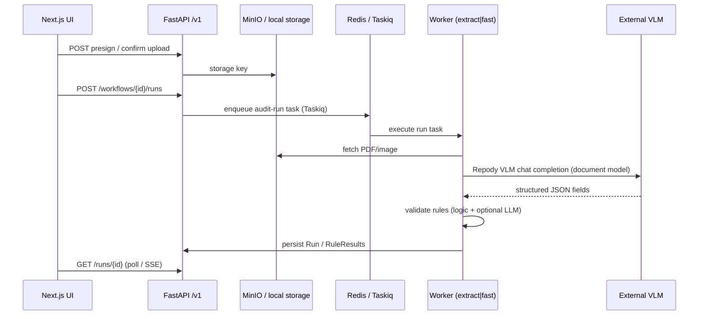

# Repody — architecture context

Single-page map for tech leads and new contributors. Operational how-tos live in [README.md](./README.md), [DEV.md](./DEV.md), and [DEPLOY.md](./DEPLOY.md). Recorded decisions live in [docs/adr/](./docs/adr/).

## Names (read once)

| Name | Where | Meaning |
|------|--------|---------|
| **Repody** | Product, repo, npm package, Helm release | Public name everywhere |
| **repody** | Python package (`backend/src/repody/`, dist name) | Import path + `pip install -e backend` |
| **`AUDIT_*`** | Env vars | Settings prefix (kept for stable ops config) |

Repody VLM local development uses NuExtract through the OpenAI-compatible llama-server/vLLM interface.

## Domain glossary

| Term | Meaning |
|------|---------|
| **Workflow** | Configured audit template: documents, field schema, validation rules |
| **Run** | One execution of a workflow against uploaded files (test or production) |
| **Document model** | Catalog adapter that maps document images → fields or markdown (`repody:vlm`, `paddleocr:v6`, `glm:ocr` — see [docs/EXTRACTION.md](./docs/EXTRACTION.md)) |
| **Processing path** | How a document is read (`document_model` = direct image-to-schema) |
| **Logic rule** | Deterministic check via `simpleeval` on extracted fields |
| **LLM rule** | Natural-language rule evaluated by a small text model (separate from Repody VLM) |
| **Worker pool `extract`** | Taskiq worker that runs document-model extraction (GPU/CPU bound) |
| **Worker pool `fast`** | Taskiq worker for logic-only / no-file runs |
| **`AUDIT_DEFAULT_DOCUMENT_MODEL_ID`** | Env name for default document model id (`repody:vlm`) |

## Request lifecycle

Vue détaillée (FR, fichiers Mermaid éditables) : [docs/diagrams/](./docs/diagrams/README.md).


```mermaid
sequenceDiagram
  participant UI as Next.js UI
  participant API as FastAPI /v1
  participant Store as MinIO / local storage
  participant Q as Redis / Taskiq
  participant W as Worker (extract|fast)
  participant Inf as External VLM

  UI->>API: POST presign / confirm upload
  API->>Store: storage key
  UI->>API: POST /workflows/{id}/runs
  API->>Q: enqueue audit-run task (Taskiq)
  Q->>W: execute run task
  W->>Store: fetch PDF/image
  W->>Inf: Repody VLM chat completion (document model)
  Inf-->>W: structured JSON fields
  W->>W: validate rules (logic + optional LLM)
  W->>API: persist Run / RuleResults
  UI->>API: GET /runs/{id} (poll / SSE)
```

All audit runs are dispatched through Taskiq (Redis Streams); worker containers execute `process_run`.

## Backend layers

```
backend/src/repody/
├── api/                 HTTP routers → app use cases
├── app/                 Application use cases (run, workflow, operator, uploads, queue, …)
│   └── run/             lifecycle · commands · processor · enqueue · outbox · progress · …
├── agents/idp/          contracts · compose · run · adapters/
├── agents/fraud/ · computer_use/   SKIPPED stubs + staged Taskiq pools
├── runtime/             Pure shared: contracts · recipe · pools · agent_metadata · metrics
├── extraction/          pipeline · vlm · nuextract · fields · render · paddleocr_v6 · glm_ocr[+sdk]
├── inference/           OpenAI-compat + NuExtract cloud (functions)
├── rules/               Logic + LLM evaluators (+ amounts)
├── catalog/             Document-model registry + probes
├── taskiq/              Worker entrypoint + async tasks
├── infra/               db · storage · auth · observability · redis · rate_limit
├── schemas/             HTTP Pydantic DTOs
└── settings/            AUDIT_* settings
```

**Hot path (staged):** `process_run` → `execute_platform_run`(one agent) → IDP `compose_idp` → optional outbox handoff to `fraud` / `computer_use` pools (updates `worker_pool` + `last_activity_at`) → `finalize_pending_completion` / `complete_run` on final stage ([ADR 007](./docs/adr/007-staged-agent-queues-taskiq.md)). Stale reap keys off activity; Fraud/CU require `*_WORKERS_READY` in addition to enable flags.

**Intentional coupling:** `api/config.py` exposes diagnostics/catalog that call extraction/inference for operator visibility.

### Bounded contexts

| Context | Responsibility | Key modules |
|---------|----------------|-------------|
| **Workflow configuration** | Templates, rules, deployment | `app/workflow/` |
| **Audit execution** | Claim/complete, queue, worker | `app/run/`, `app/run/processor.py`, `app/run/enqueue.py`, `taskiq/` |
| **IDP agent** | Extract + validate for a claimed Run | `agents/idp/` |
| **Platform / catalog** | Recipe, envelopes, registry, operator | `runtime/`, `catalog/`, `app/operator/` |

### Three-agent platform

**IDP** lives under `agents/idp/`. **Fraud** / **Computer Use** are SKIPPED scaffolds under `agents/fraud/` and `agents/computer_use/` with dedicated Taskiq pools (`fraud`, `computer_use`) for independent scaling. IDP capacity pools remain `extract` / `fast`. Envelopes: `runtime/contracts/`. Design: [docs/architecture/idp-functional-agents.md](./docs/architecture/idp-functional-agents.md) · [ADR 006](./docs/adr/006-three-agent-functional-idp.md) · [ADR 007](./docs/adr/007-staged-agent-queues-taskiq.md).

Domain events (`RunStarted`, `RunCompleted`, `RunFailed`) drive queue refresh and SSE. `RunStatus` is canonical in `runtime/run/status.py`.

**Run lifecycle (flat):** `app/run/lifecycle.py` (entity + pure transitions) · `commands.py` (claim/complete/fail/finalize + event publish) · `persistence.py`. Worker entry: `app/run/processor.py`.

## Operator tools

Operator endpoints are diagnostic/admin workflows, not the audit run hot path:

- `api/operator.py` keeps HTTP concerns: routes, permissions, status codes, and typed response models.
- `app/operator/` — job lifecycle (`jobs.py` + Redis persistence), benchmarks (`benchmarks.py` subprocess), direct VLM warmup (`warmup_repody_vlm`), form validation (`requests.py`), reports, and Keycloak token via `infra/auth/keycloak_token.py`.

## Catalog package (unified)

| Module | Role |
|--------|------|
| `catalog/registry.py` | Document model specs and extraction dispatch |
| `catalog/probes.py` | Live runtime probes |
| `catalog/api.py` | `/models/catalog` assembly |
| `catalog/runtime_fields.py` | Operator runtime config |

Import `catalog/registry.py` directly for document model catalog operations.

## Three registries (do not merge)

| Module | Selects | Example ids |
|--------|---------|-------------|
| `extraction/pipeline.py` (`get_extract_document`) | **Extractor callable** | `stub`, `pipeline` (`AUDIT_EXTRACTOR`) |
| `catalog/registry.py` | **Document model catalog** | `repody:vlm`, `repody:vlm:cloud`, `paddleocr:v6`, `glm:ocr` |
| `catalog/probes.py` + `catalog/api.py` | **Catalog + live runtime probes** | used by `/models/catalog`, diagnostics, healthz |

Flow: `get_extract_document()` → `extract_document(...)` → catalog → model adapter
(`extraction/vlm.py`, `paddleocr_v6.py`, or `glm_ocr.py`) on the runtime selected by
the catalog entry / `AUDIT_*` env.

## Inference

| Concern | Configuration |
|---------|---------------|
| Document extraction | `AUDIT_INFERENCE_MODE=llamacpp`, `AUDIT_LLAMACPP_BASE_URL`, `AUDIT_LLAMACPP_SERVED_MODEL` |
| LLM rule validation | `get_chat()` / `chat_validation` when `AUDIT_LLM_VALIDATION_ENABLED=true` |

Document extraction and LLM rule validation use **separate** models and endpoints.

### LLM rule validation modules

- `rules/runner.py` chooses logic vs LLM rule execution for a Run.
- `rules/llm_evaluator.py` orchestrates validation-model availability, structured calls, and batch result handling.
- `rules/llm_fields.py` owns field-reference parsing, selected field values, and deterministic keyword shortcuts.
- `rules/llm_prompts.py` owns prompt text for single-rule and batch validation.

Add future document models in `catalog/registry.py` (`_registered_models()`).

## Frontend layout

Next.js 16 App Router at repo root (not under `frontend/`):

- `app/` — routes (thin pages)
- `components/` — domain UI (`workflow/`, `audit/`, `dashboard/`)
- `lib/api/` — typed clients; RSC uses `serverFetch`/`serverJson`, client islands use `/api/*` rewrite to backend `/v1/*`

## Platform modules (deploy)

Runtime is split into deploy **modules** (`control`, `workers`, `edge`). Production uses Kubernetes + Helm on the client cluster; **daily local dev uses Docker Compose** ([docs/deploy/LOCAL.md](./docs/deploy/LOCAL.md)). OpenShift install: [docs/deploy/CLIENT.md](./docs/deploy/CLIENT.md). See [docs/PLATFORM.md](./docs/PLATFORM.md), [ADR 004](./docs/adr/004-cloud-kubernetes-packaging.md), and [ADR 005](./docs/adr/005-kubernetes-only-external-inference.md).

| Term | Meaning |
|------|---------|
| **Platform module** | Independently deployable Kubernetes workload group (microservice seam) |
| **Local stack** | Compose + host processes (`pnpm dev`, `pnpm dev:api`, `pnpm ui`) |
| **Worker plane** | Horizontally scaled Taskiq workers (`worker-extract`, `worker-fast`) |

## Local development

See [docs/COMMANDS.md](./docs/COMMANDS.md).

| Lane | Command |
|------|---------|
| App development | `pnpm dev:all` or `pnpm dev` + `pnpm dev:app` |
| OpenShift CRC lab | [docs/deploy/OPENSHIFT.md](./docs/deploy/OPENSHIFT.md) |
| OpenShift verify | [docs/deploy/OPENSHIFT.md](./docs/deploy/OPENSHIFT.md) |
| Release to client | `pnpm images:release` → client Helm / Argo CD |

Chart: [deploy/helm/repody](./deploy/helm/repody). Client install: [docs/deploy/CLIENT.md](./docs/deploy/CLIENT.md).

## Non-product paths

These directories are agent/tooling assets, not runtime dependencies:

- `.agents/skills/` — Cursor agent skills (including `ui-ux-pro-max` design data)
- `backend/scripts/research/` · `deploy/scripts/research/` — experimental benches
- `docs/experiments/` — research notes (not onboarding)
- `benchmark-reports/` — local benchmark output (gitignored)

## Tests

| Layer | Command | CI |
|-------|---------|-----|
| Backend unit/integration | `pnpm test:api` | `.github/workflows/ci.yml` |
| Live stack (Taskiq workers) | `E2E_STACK=1 pytest -m live` | k8s-smoke / manual |
| Playwright smoke | `pnpm test:e2e:smoke` | `.github/workflows/ci.yml` |
| Full platform | `pnpm test:platform` | Manual / nightly (heavier) |

Command reference: [docs/COMMANDS.md](./docs/COMMANDS.md).

Run completion and Taskiq dispatch are **not** simulated in-process. Use `@pytest.mark.live` with a running Kubernetes stack (`E2E_STACK=1`, `E2E_API_URL`).

## Authorization (Casbin)

JWT roles map to permissions in `auth/rbac_policy.csv`. Routers use `require_permission(resource, action)` — not a blanket admin gate. When `AUDIT_OIDC_ENABLED=false` (local dev/tests), the API uses a `platform_admin` dev principal.

| Role | Typical access |
|------|----------------|
| `viewer` | Read workflows, runs, audits, models, rules |
| `operator` | Viewer + write workflows, execute runs, metrics/dashboard, operator tools |
| `admin` | Operator + settings, diagnostics, users |

## Further reading

- [docs/README.md](./docs/README.md) — documentation index
- [docs/PLATFORM-INVENTORY.md](./docs/PLATFORM-INVENTORY.md) — full platform inventory (features, security, prod, libs)
- [docs/adr/001-taskiq-async-runs.md](./docs/adr/001-taskiq-async-runs.md)
- [docs/adr/002-repody-vlm-dual-inference-runtimes.md](./docs/adr/002-repody-vlm-dual-inference-runtimes.md)
- [docs/BACKEND.md](./docs/BACKEND.md) — backend layout and conventions
- [docs/E2E.md](./docs/E2E.md) — full stack test layers
