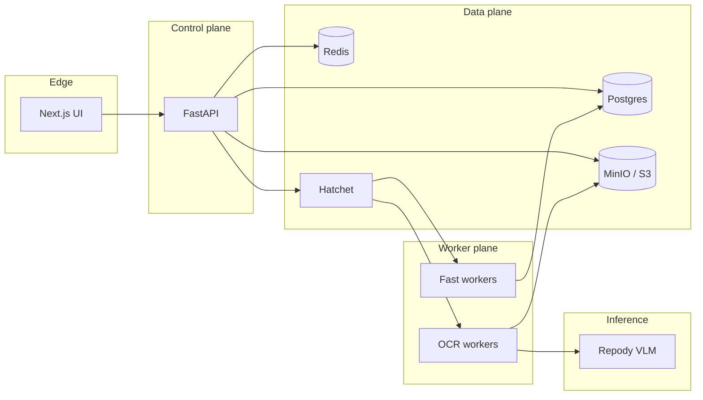

# Repody

**Open-source document audit platform** — upload invoices and contracts, extract structured fields with vision-language models, validate business rules, and ship workflows through a visual builder.

[](https://github.com/MehdiGououiad/repody/actions/workflows/ci.yml)
[](LICENSE)

---

## Why Repody

Teams auditing documents usually stitch together OCR, spreadsheets, and one-off scripts. Repody gives you one stack:

- **Workflow builder** — define documents, field schemas, and validation rules
- **Repody VLM** — vision-language extraction (upstream weights: `numind/NuExtract3`)
- **Rule engine** — deterministic logic rules plus optional LLM checks
- **Async runs** — Hatchet workers scale OCR-heavy and fast logic pools independently
- **Self-hostable** — Docker Compose for dev/prod, Helm chart for Kubernetes



---

## Quick start (fast dev)

**Prerequisites:** [Docker Desktop](https://www.docker.com/products/docker-desktop/), [Node 22+](https://nodejs.org/), [pnpm 10](https://pnpm.io/), [Python 3.12](https://www.python.org/) (optional — API runs in Docker).

```powershell
git clone https://github.com/MehdiGououiad/repody.git
cd repody
pnpm install
pnpm dev
```

| Service | URL |
|---------|-----|
| **UI** | http://localhost:3000 |
| **API** | http://localhost:8000 |

`pnpm dev` starts the Docker backend and production Next.js on your host. First boot can take **30–60 seconds**.

**Stop:** `pnpm stop` or Ctrl+C in the dev terminal.

Copy env defaults if needed:

```powershell
cp .env.example .env.local
```

---

## Development modes

| Goal | Command |
|------|---------|
| **Daily dev** | `pnpm dev` |
| **VLM warmup** | `pnpm dev -- --warmup` |
| **Hot-reload UI** | `pnpm ui` |
| **All-in-Docker prod** | `pnpm prod -- --warmup` |
| **Observability** | `pnpm dev -- --logs --traces` |

Full workflow: **[DEV.md](./DEV.md)**

---

## Production deploy

### Linux VPS (HTTPS, recommended)

On Ubuntu 22.04/24.04 with DNS pointing at the server:

```bash
git clone https://github.com/MehdiGououiad/repody.git && cd repody
bash deploy/cloud/deploy.sh
```

See **[DEPLOY.md](./DEPLOY.md)** — TLS, basic auth, CPU or external GPU inference.

### Docker Compose (single host)

```powershell
pnpm compose up --stack=prod --build
pnpm compose up --stack=gpu --build
pnpm compose up --stack=prod --scale --build --scale-worker=2
pnpm compose up --stack=vps --build
```

See **[DEPLOY.md](./DEPLOY.md)** for LAN, public URLs, observability, and go-live checklist.

### Kubernetes (Helm)

```bash
REGISTRY=ghcr.io/YOUR_ORG TAG=0.1.0 pnpm images:build
pnpm images:push
pnpm helm:deps
helm upgrade --install repody deploy/helm/repody -n repody --create-namespace -f my-values.yaml
```

See **[docs/CLOUD-K8S.md](./docs/CLOUD-K8S.md)**.

---

## Architecture

Repody is a **modular monorepo**:

| Module | Role |
|--------|------|
| **edge** | Next.js 16 App Router (`app/`, `components/`) |
| **control** | FastAPI API (`backend/src/audit_workbench/`) |
| **workers** | Hatchet workers — `ocr` pool (VLM) + `fast` pool (logic) |
| **infra** | Postgres, Redis, MinIO, Hatchet Lite |

Deep dive: **[CONTEXT.md](./CONTEXT.md)** · Decisions: **[docs/adr/](./docs/adr/)**

---

## Documentation

| Doc | Description |
|-----|-------------|
| [DEPLOY.md](./DEPLOY.md) | **All deployment** — local prod, VPS, GPU, scaling |
| [deploy/README.md](./deploy/README.md) | Deploy folder index (compose, helm, VPS) |
| [deploy/ENV.md](./deploy/ENV.md) | Environment variables and secrets |
| [DEV.md](./DEV.md) | Fast iteration, reload matrix |
| [docs/PLATFORM.md](./docs/PLATFORM.md) | Modules, stacks, scale (`pnpm compose modules`) |
| [docs/CLOUD-K8S.md](./docs/CLOUD-K8S.md) | Helm install and scaling |
| [docs/REPODY-VLM.md](./docs/REPODY-VLM.md) · [docs/OCR_CPU.md](./docs/OCR_CPU.md) | Inference (GPU / CPU) |
| [docs/OBSERVABILITY.md](./docs/OBSERVABILITY.md) · [docs/BUGSINK.md](./docs/BUGSINK.md) | Optional `--with=obs` / Bugsink DSN |
| [docs/E2E.md](./docs/E2E.md) | Playwright and integration tests |

---

## Testing

```powershell
pnpm test:api              # Backend unit tests (no live services)
pnpm test:e2e:smoke        # Playwright smoke (needs stack)
pnpm lint                  # ESLint
```

CI runs backend pytest + frontend lint/typecheck/build on every push to `master`.

---

## Tech stack

- **Frontend:** Next.js 16, React 19, Tailwind, Radix UI
- **Backend:** FastAPI, SQLAlchemy 2, Alembic, Pydantic v2
- **Jobs:** [Hatchet](https://hatchet.run/) Lite (self-hosted)
- **Storage:** MinIO (S3-compatible) or local filesystem
- **Inference:** Docker Model Runner (CPU) or vLLM (GPU)
- **Observability:** Loki, Grafana, OpenTelemetry; **Bugsink** for errors (optional, self-hosted)

---

## Contributing

Contributions welcome. Start with [DEV.md](./DEV.md), run `pnpm test:api` before opening a PR, and follow existing code style in the area you touch.

---

## License

[Apache License 2.0](LICENSE) — Copyright 2026 Mehdi Gououiad

---

## Repository

- **GitHub:** https://github.com/MehdiGououiad/repody
- **Issues:** https://github.com/MehdiGououiad/repody/issues
