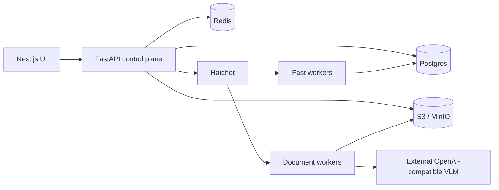

# Repody

Open-source document audit platform: upload invoices and contracts, extract
structured fields with vision-language models, validate business rules, and ship
workflows through a visual builder.

[](https://github.com/MehdiGououiad/repody/actions/workflows/ci.yml)
[](LICENSE)

## Why Repody

- Workflow builder for documents, field schemas, and validation rules
- Vision-language extraction through an external OpenAI-compatible VLM endpoint
- Deterministic logic rules plus optional LLM checks
- Hatchet workers for async audit runs
- Kubernetes-first deployment with Helm (local kind cluster for development)
- Gateway API edge (Envoy) with in-cluster Keycloak for OIDC



## Quick Start

Prerequisites: Docker Desktop, Node 22+, pnpm 10+, `kind`, `kubectl`, `helm`.

```powershell
git clone https://github.com/MehdiGououiad/repody.git
cd repody
pnpm install
pnpm harbor:bootstrap   # once — local Harbor registry
pnpm k8s:local:hosts    # once (admin) — maps *.repody.local
pnpm dev                # bootstrap stack once
pnpm dev:sync           # daily Skaffold hot sync
```

Stop app: `pnpm stop` — tear down cluster: `pnpm stop:cluster`

| Service | URL |
|---------|-----|
| UI | http://app.repody.local |
| API | http://api.repody.local |
| Keycloak | http://auth.repody.local |

Sign in: `operator@repody.local` / `repody-dev`

Stop with `pnpm stop` or `pnpm k8s:local:down`.

## Development

| Goal | Command |
|------|---------|
| Start / update stack | `pnpm k8s:local` or `pnpm dev` |
| Recreate cluster | `pnpm k8s:local:reset` |
| Smoke test | `pnpm k8s:local:smoke` |
| Force image rebuild | `pnpm k8s:local -- --build` |

External inference (VLM runs outside the chart):

```powershell
$env:REPODY_VLLM_BASE_URL="https://your-vlm-host/v1"
$env:REPODY_VLLM_SERVED_MODEL="your-model"
pnpm k8s:local
```

See [DEV.md](./DEV.md) for day-to-day workflow.

## Production

Production deployment is Kubernetes-only. The Repody Helm chart deploys the API,
workers, web, data plane, auth wiring, and scaling. It does not deploy inference.
Run **vLLM** or **llama-server** separately and point
`config.vllmBaseUrl` at it.

```powershell
pnpm images:build
pnpm images:push
```

See [DEPLOY.md](./DEPLOY.md) and [docs/CLOUD-K8S.md](./docs/CLOUD-K8S.md).

## Documentation

Full index: [docs/README.md](./docs/README.md)

## Testing

```powershell
pnpm test:api              # Backend unit tests (no live services)
pnpm test:e2e:smoke        # Playwright smoke (needs stack)
pnpm lint                  # ESLint
```

CI runs backend pytest + frontend lint/typecheck/build on every push to `master`.

## Tech stack

- **Frontend:** Next.js 16, React 19, Tailwind, Radix UI
- **Backend:** FastAPI, SQLAlchemy 2, Alembic, Pydantic v2
- **Jobs:** [Hatchet](https://hatchet.run/) Lite (self-hosted locally)
- **Storage:** MinIO (S3-compatible) or local filesystem
- **Inference:** External vLLM or llama-server
- **Observability:** Loki, Grafana, OpenTelemetry; **Bugsink** for errors (optional, self-hosted)

## Contributing

Contributions welcome. Start with [DEV.md](./DEV.md), run `pnpm test:api` before opening a PR, and follow existing code style in the area you touch.

## License

[Apache License 2.0](LICENSE) — Copyright 2026 Mehdi Gououiad

## Repository

- **GitHub:** https://github.com/MehdiGououiad/repody
- **Issues:** https://github.com/MehdiGououiad/repody/issues
