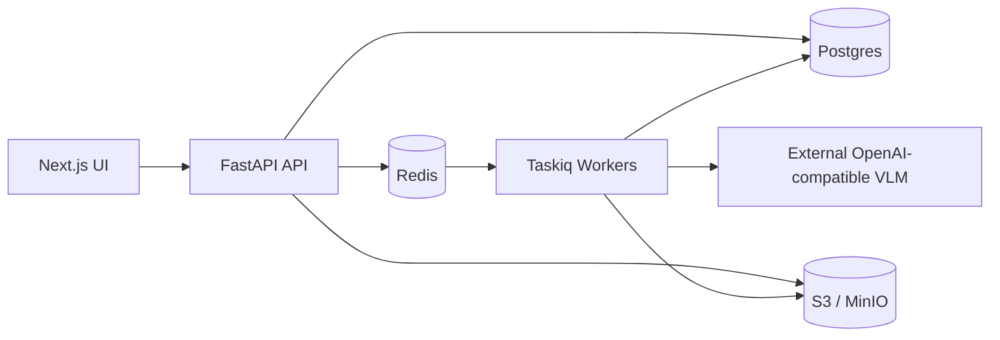

# Repody

Open-source document audit platform for invoices and contracts. Repody uploads
documents, extracts structured fields with an external vision-language model,
validates business rules, and runs async workflows through Taskiq workers.

[](https://github.com/MehdiGououiad/repody/actions/workflows/ci.yml)
[](LICENSE)

## Architecture



Production inference is not bundled in the chart. Run vLLM, llama-server, or a
managed OpenAI-compatible endpoint separately and point Repody at it.

## Quick start (local development)

Prerequisites: Docker Desktop, Node 24.x, Corepack-managed pnpm 11.7.0.

```powershell
corepack enable
pnpm install
pnpm doctor
pnpm dev
pnpm db:migrate
copy deploy\env\compose.env.example backend\.env
pnpm dev:api    # terminal 1
pnpm ui         # terminal 2
pnpm llamacpp:serve   # terminal 3 (extraction)
```

Sign in at http://localhost:3000 with Keycloak from Compose (see [docs/deploy/LOCAL.md](./docs/deploy/LOCAL.md)).

**Client OpenShift:** [docs/deploy/CLIENT.md](./docs/deploy/CLIENT.md) · **CRC lab:** [docs/deploy/OPENSHIFT.md](./docs/deploy/OPENSHIFT.md)

**Release to a client:** `pnpm images:release` to Harbor; they deploy with Helm or Argo CD. See [docs/COMMANDS.md](./docs/COMMANDS.md).

## Documentation

| Need | Read |
|------|------|
| Commands | [docs/COMMANDS.md](./docs/COMMANDS.md) |
| Local development | [DEV.md](./DEV.md) |
| Production deployment | [DEPLOY.md](./DEPLOY.md) |
| Architecture | [CONTEXT.md](./CONTEXT.md) |
| Full docs map | [docs/README.md](./docs/README.md) |

## Stack

- Frontend: Next.js 16, React 19, Tailwind
- Backend: FastAPI, SQLAlchemy 2, Alembic, Pydantic v2
- Jobs: Taskiq over Redis Streams
- Local platform: kind, Helm, Envoy Gateway
- Storage: MinIO or S3-compatible object storage

## License

[Apache License 2.0](LICENSE)
