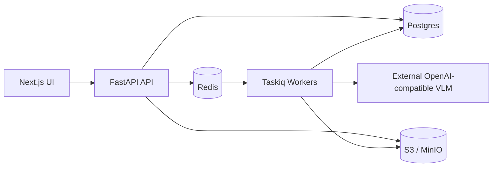

# Repody

Open-source document audit platform for invoices and contracts. Repody uploads
documents, extracts structured fields with an external vision-language model,
validates business rules, and runs async workflows through Taskiq workers.

[](https://github.com/MehdiGououiad/repody/actions/workflows/ci.yml)
[](LICENSE)

## Architecture


```mermaid
flowchart LR
  Web[Next.js UI] --> API[FastAPI API]
  API --> PG[(Postgres)]
  API --> RD[(Redis)]
  API --> S3[(S3 / MinIO)]
  RD --> W[Taskiq Workers]
  W --> VLM[External OpenAI-compatible VLM]
  W --> S3
  W --> PG
```

Production inference is not bundled in the chart. Run vLLM, llama-server, or a
managed OpenAI-compatible endpoint separately and point Repody at it.

## Quick start (new machine)

Prerequisites: Docker Desktop, Node 24.x, Corepack pnpm 11.7.0, `llama-server` on PATH
(`winget install ggml.llamacpp` / `brew install llama.cpp`).

```bash
git clone https://github.com/MehdiGououiad/repody.git
cd repody
corepack enable
pnpm install
pnpm doctor
pnpm platform setup    # once: env files + docker pull Hub images
pnpm platform          # start API/UI/workers + host NuExtract (repody:vlm)
pnpm platform status
```

Images come from Docker Hub (`mehdigououiad/repody-*`), not a local build.
Sign in at http://localhost:3000 · `operator@repody.local` / `repody-dev`.

Daily: `pnpm platform` · stop: `pnpm platform stop`  
- **Mac (M1/M2/M3) end to end:** [docs/deploy/MAC.md](./docs/deploy/MAC.md)  
- All OSes: [docs/deploy/LOCAL.md](./docs/deploy/LOCAL.md) · commands: [docs/COMMANDS.md](./docs/COMMANDS.md)

**Client OpenShift:** [docs/deploy/OPENSHIFT.md](./docs/deploy/OPENSHIFT.md) · [docs/deploy/CLIENT.md](./docs/deploy/CLIENT.md)

**Release to a client:** `pnpm images:release` to GHCR or client registry; they deploy with Helm or Argo CD. See [docs/COMMANDS.md](./docs/COMMANDS.md).

## Documentation

**Full map (one place):** [docs/README.md](./docs/README.md)

| Need | Read |
|------|------|
| **Mac deploy (end to end)** | [docs/deploy/MAC.md](./docs/deploy/MAC.md) |
| Commands | [docs/COMMANDS.md](./docs/COMMANDS.md) |
| Local development | [DEV.md](./DEV.md) · [docs/deploy/LOCAL.md](./docs/deploy/LOCAL.md) |
| Production / OpenShift | [DEPLOY.md](./DEPLOY.md) · [docs/deploy/README.md](./docs/deploy/README.md) |
| Architecture | [CONTEXT.md](./CONTEXT.md) |
| Code quality review | [docs/CODE-QUALITY.md](./docs/CODE-QUALITY.md) |

## Stack

- Frontend: Next.js 16, React 19, Tailwind
- Backend: FastAPI, SQLAlchemy 2, Alembic, Pydantic v2
- Jobs: Taskiq over Redis Streams
- Local platform: kind, Helm, Envoy Gateway
- Storage: MinIO or S3-compatible object storage

## License

[Apache License 2.0](LICENSE)
