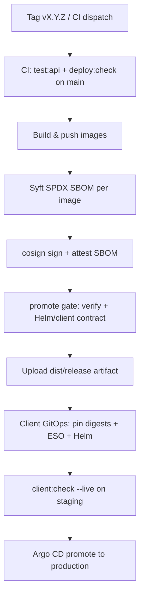

# Release methodology (vendor → client)

Ship Repody with **immutable images**, **SPDX SBOMs**, **cosign signatures**, and a **promotion gate** before client handoff.

Official references:

- [Sigstore cosign](https://docs.sigstore.dev/cosign/overview/)
- [Syft SBOM](https://github.com/anchore/syft)
- [Helm](https://helm.sh/docs/intro/install/)
- [External Secrets Operator](https://external-secrets.io/)

## Lanes

| Lane | Registry | Signing | When |
|------|----------|---------|------|
| **GitHub release** | GHCR (`ghcr.io/<owner>`) | cosign keyless (OIDC) | Tag `v*` or workflow dispatch |
| **On-prem / client registry** | `registry.example.com/repody` | cosign with `COSIGN_KEY` | Customer-facing registry |
| **Air-gap** | Client import | SHA256 bundle + optional cosign pubkey | Disconnected sites |

Client install (values, Vault, Helm) is unchanged — see [CLIENT.md](./CLIENT.md).

---

## Release flow (best practice)



### 1. Pre-release (main branch)

CI on every PR/main:

- `pnpm deploy:check` — Helm lint/template, client manifests, **release-supply-chain --check**
- Backend + frontend tests, `pnpm deploy:check`

### 2. Publish images

**GitHub (recommended):**

```bash
git tag v1.2.3
git push origin v1.2.3
```

Workflow [`.github/workflows/images-ghcr.yml`](../../.github/workflows/images-ghcr.yml) runs:

1. `build-images.mjs --push`
2. `release-supply-chain.mjs attest` (syft + cosign keyless)
3. `release-supply-chain.mjs promote --channel=staging`
4. Upload `dist/release/<tag>/` artifact (manifest, SBOMs, `helm-images.yaml`)

**On-prem / manual push:**

```powershell
$env:REPODY_IMAGE_REGISTRY="registry.example.com/repody"
$env:REPODY_IMAGE_TAG="1.2.3"
pnpm images:release
pnpm release:attest    # requires syft + cosign locally
pnpm release:promote -- --channel=staging
```

For on-prem registries, use a **private key** (not keyless):

```powershell
$env:COSIGN_KEY="C:\secrets\cosign.key"
$env:COSIGN_PASSWORD="..."
$env:COSIGN_PUBLIC_KEY="deploy/release/cosign.pub"   # ship to clients for verify
pnpm release:attest
```

Generate key pair once: `cosign generate-key-pair` ([docs](https://docs.sigstore.dev/cosign/key_management/signing_with_a_self_managed_key/)).

**One-shot:**

```powershell
pnpm release:all   # push + attest + promote (staging)
```

### 3. Verify before handoff

```powershell
$env:REPODY_IMAGE_REGISTRY="ghcr.io/yourorg"
$env:REPODY_IMAGE_TAG="v1.2.3"
pnpm release:verify
```

Or re-run promotion in CI: **Actions → Release promotion** ([`release-promote.yml`](../../.github/workflows/release-promote.yml)).

Verification checks:

- cosign signature (keyless OIDC or `COSIGN_PUBLIC_KEY`)
- SPDX SBOM files on disk (from attest or downloaded artifact)
- Image digests resolved via `docker buildx imagetools inspect`

### 4. Promotion artifact

After `pnpm release:promote`, bundle at `dist/release/<tag>/`:

| File | Purpose |
|------|---------|
| `release-manifest.json` | Git SHA, digests, SBOM paths, channel |
| `helm-images.yaml` | Pin `repository`, `tag`, `digest` for client values |
| `sbom/*.spdx.json` | SPDX SBOM per image |
| `SHA256SUMS` | SBOM checksums |

Send artifact + public cosign key (on-prem lane) to the client.

### 5. Client promotion

1. Merge `helm-images.yaml` into GitOps (prefer **digest** pins)
2. Apply ExternalSecrets ([SECRETS.md](./SECRETS.md))
3. `pnpm client:check` then `pnpm client:check -- --live` on staging
4. Argo CD sync: `repody-data` → `repody`
5. Production: run **Release promotion** workflow with `channel=production` after staging sign-off

---

## Commands

| Command | Role |
|---------|------|
| `pnpm images:build` | Local images only |
| `pnpm images:release` | Build + push |
| `pnpm release:attest` | SBOM + cosign sign + attest |
| `pnpm release:verify` | Verify signatures |
| `pnpm release:manifest` | Write manifest without full gate |
| `pnpm release:promote` | Verify + client contract + manifest |
| `pnpm release:all` | push + attest + promote |
| `pnpm client:check` | Client Helm/ESO preflight |
| `pnpm openshift:client-test` | OpenShift client lab (Harbor, Vault, OTEL) |

---

## Troubleshooting

| Issue | Fix |
|-------|-----|
| `syft not found` | Install syft or run attest in CI only |
| `cosign verify` identity mismatch | Set `COSIGN_CERTIFICATE_IDENTITY` to workflow `@.*` pattern |
| Digest lookup fails | Login to registry; image must exist after push |
| On-prem keyless blocked | Use `COSIGN_KEY` + distribute `cosign.pub` to clients |

See also [CLIENT.md](./CLIENT.md), [VENDOR-TO-CLIENT.md](./VENDOR-TO-CLIENT.md).
