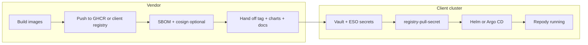

# Vendor → client: push images and cluster deploy

End-to-end flow so the **vendor ships images** and the **client pulls and deploys** with Helm or Argo CD — no vendor access to the client cluster.

Official references:

- [GitHub Container Registry](https://docs.github.com/en/packages/working-with-a-github-packages-registry/working-with-the-container-registry)
- [External Secrets Operator](https://external-secrets.io/latest/)
- [Kubernetes Ingress](https://kubernetes.io/docs/concepts/services-networking/ingress/)
- [Helm install](https://helm.sh/docs/intro/install/)

---

## Overview



| Role | Responsibility |
|------|----------------|
| **Vendor** | Build, push to GHCR or client registry, publish Helm charts, document tag |
| **Client** | Registry pull secret, Vault secrets, values in private GitOps, Helm/Argo |

---

## Part 1 — Vendor: push images

### Step 1: Choose a registry

| Option | When | Example base |
|--------|------|--------------|
| **GHCR** | GitHub-hosted releases | `ghcr.io/yourorg/repody` |
| **Client registry** | On-prem or cloud registry the client operates | `registry.example.com/repody` |

See [deploy/registry/README.md](../../deploy/registry/README.md) for GHCR setup and pull-secret examples.

### Step 2: Create credentials (recommended)

- **GHCR:** GitHub PAT with `write:packages` (vendor CI) and `read:packages` (share with client)
- **On-prem:** Robot account or service principal with push (vendor) and pull (client) scopes

### Step 3: Log in and push from the vendor workstation

Registry base must include the **project or namespace path**:

```powershell
# ghcr.io/yourorg/repody  ← host + project (not just host)
$env:REPODY_IMAGE_REGISTRY="ghcr.io/yourorg/repody"
$env:REPODY_IMAGE_TAG="1.0.0"

docker login ghcr.io -u <github-user>
pnpm images:release
```

This builds and pushes:

| Image | Full reference |
|-------|----------------|
| Backend (API + workers) | `ghcr.io/yourorg/repody/repody-backend:1.0.0` |
| Web UI | `ghcr.io/yourorg/repody/repody-web:1.0.0` |

Implementation: [`deploy/scripts/build-images.mjs`](../../deploy/scripts/build-images.mjs) (BuildKit).

GitHub tag workflow: push `v*` → [images-ghcr.yml](../../.github/workflows/images-ghcr.yml) builds, signs, and uploads release artifacts.

### Step 4: Supply chain (recommended)

```powershell
pnpm release:attest    # Syft SBOM + cosign sign
pnpm release:promote -- --channel=staging
```

See [RELEASE.md](./RELEASE.md).

### Step 5: Hand off to the client

Deliver:

| Item | Example |
|------|---------|
| Registry host + project | `ghcr.io/yourorg/repody` |
| Immutable image tag | `1.0.0` |
| Pull credentials | PAT, robot account, or client-specific pull user |
| Helm charts | Git path `deploy/helm/repody`, `repody-data`, `repody-auth` |
| Values templates | `deploy/client/values-{external,bundled}.example.yaml` |
| This guide + [CLIENT.md](./CLIENT.md) + [SECRETS.md](./SECRETS.md) |

---

## Part 2 — Client: pull secret and deploy

### Step 1: Preflight

```bash
pnpm client:check
pnpm deploy:check
```

### Step 2: Namespace and Pod Security

```bash
kubectl apply -f deploy/client/namespace.example.yaml
```

### Step 3: Vault + External Secrets Operator

Install Vault and ESO per [SECRETS.md](./SECRETS.md). Configure a `ClusterSecretStore` pointing at client Vault.

### Step 4: Store registry pull credentials in Vault

Create a docker config JSON for the registry **host** the kubelet will use:

```json
{
  "auths": {
    "ghcr.io": {
      "username": "client-pull-bot",
      "password": "…",
      "auth": "…"
    }
  }
}
```

Store at Vault path `secret/repody/production` key `REGISTRY_DOCKERCONFIGJSON`.

### Step 5: Apply ExternalSecrets

**Bundled profile** — all three:

```bash
kubectl apply -f deploy/client/secrets/registry-pull.externalsecret.example.yaml
kubectl apply -f deploy/client/secrets/data-plane.externalsecret.example.yaml
kubectl apply -f deploy/client/secrets/runtime-bundled.externalsecret.example.yaml
# Patch CHANGE_ME_SECRET_STORE → your ClusterSecretStore name
kubectl -n repody wait externalsecret --all --for=condition=Ready --timeout=5m
```

**External profile** — registry + runtime:

```bash
kubectl apply -f deploy/client/secrets/registry-pull.externalsecret.example.yaml
kubectl apply -f deploy/client/secrets/runtime.externalsecret.example.yaml
```

Populate all Vault keys listed in [SECRETS.md](./SECRETS.md) before waiting for Ready.

### Step 6: Client values (private GitOps repo)

Copy the template for your profile to a **private repo** (never commit secrets):

```bash
cp deploy/client/values-bundled.example.yaml ~/repody-gitops/values.yaml
# or values-external.example.yaml
```

Edit placeholders:

| Placeholder | Set to |
|-------------|--------|
| `CHANGE_ME_REGISTRY` | `ghcr.io/yourorg/repody` or `registry.client.example.com/repody` |
| `CHANGE_ME_TAG` | `1.0.0` (immutable tag from vendor) |
| `CHANGE_ME_*_HOST` | Client DNS names |
| `config.llamacppBaseUrl` | Client VLM endpoint ([REPODY-VLM.md](../REPODY-VLM.md)) |
| `config.oidcIssuer` | Client IdP |

Image repositories in values resolve to:

```yaml
images:
  api:
    repository: ghcr.io/yourorg/repody/repody-backend
    tag: "1.0.0"
```

### Step 7: Helm install

**Bundled** (Postgres + Redis + MinIO in-cluster):

```bash
pnpm helm:deps:update

helm upgrade --install repody-data deploy/helm/repody-data -n repody \
  -f deploy/helm/repody-data/values.yaml \
  -f deploy/client/bundled/values.data.yaml

helm upgrade --install repody deploy/helm/repody -n repody \
  -f deploy/helm/repody/values.yaml \
  -f deploy/helm/repody/values-common.yaml \
  -f ~/repody-gitops/values.yaml \
  -f deploy/client/values-enterprise.example.yaml \
  --wait --timeout 25m
```

**External** (BYO Postgres, Redis, S3):

```bash
helm upgrade --install repody deploy/helm/repody -n repody --create-namespace \
  -f deploy/helm/repody/values.yaml \
  -f deploy/helm/repody/values-common.yaml \
  -f ~/repody-gitops/values.yaml \
  -f deploy/client/values-enterprise.example.yaml \
  --wait --timeout 25m
```

**OpenShift:** add `-f deploy/values/openshift.yaml` to the `repody` install. See [OPENSHIFT.md](./OPENSHIFT.md).

### Step 8: Verify

```bash
curl -fsS https://<api-host>/v1/healthz/live
kubectl -n repody get pods
pnpm openshift:client-ready   # OpenShift only
```

---

## Part 3 — Argo CD (optional, recommended for production)

Use multi-source Applications: vendor chart + client values repo.

Example: [`deploy/client/argocd.application.yaml`](../../deploy/client/argocd.application.yaml)

**Bundled:** sync `repody-data` (wave 0) before `repody` (wave 2). Lab reference: [OPENSHIFT.md](./OPENSHIFT.md).

Argo CD docs: [Private repositories](https://argo-cd.readthedocs.io/en/stable/user-guide/private-repositories/)

---

## Part 4 — Vendor QA labs (not client install)

| Lab | Command | Proves |
|-----|---------|--------|
| Local Compose | `pnpm dev:all` | Daily dev — [LOCAL.md](./LOCAL.md) |
| OpenShift client test | `pnpm openshift:client-test` | Harbor + Vault + Argo CD + OTEL — [OPENSHIFT.md](./OPENSHIFT.md) |

---

## Troubleshooting

| Symptom | Fix |
|---------|-----|
| `ImagePullBackOff` | Check `registry-pull-secret`; auth host must match image registry host |
| `no basic auth credentials` | ESO not synced — `kubectl describe externalsecret -n repody` |
| Wrong image path | Registry = `host/project`; repository = `{registry}/repody-backend` |
| API crash `Invalid endpoint: http://` | Set `externalObjectStorage.endpoint` (bundled: `repody-data-minio:9000`) |
| DB `relation does not exist` | Enable `migrations.enabled: true` or run migrations job |

---

## Modular code layout

| Path | Purpose |
|------|---------|
| `deploy/scripts/build-images.mjs` | Vendor image build/push |
| `deploy/scripts/release-supply-chain.mjs` | SBOM, cosign, promotion |
| `deploy/scripts/lib/cli.mjs` | CLI helpers (`parseArgs`, `log`, `fail`, `sleep`) |
| `deploy/scripts/lib/vault-eso.mjs` | Vault KV + ExternalSecret apply/wait |
| `deploy/scripts/lib/vault-bootstrap.mjs` | Vault K8s auth bootstrap |
| `deploy/scripts/lib/bundled-values.mjs` | Bundled Helm values generator |
| `deploy/scripts/lib/lab-seed.mjs` | Lab Vault KV payloads |
| `deploy/scripts/lib/migrations-job.mjs` | Manual migrations Job (lab fallback) |
| `deploy/scripts/lib/lab-security.mjs` | Restricted PodSecurity fragments |
| `deploy/client/` | Client YAML kit only |

Lab script: `deploy/scripts/openshift-client-test.mjs` (shared lib modules under `deploy/scripts/lib/`).
